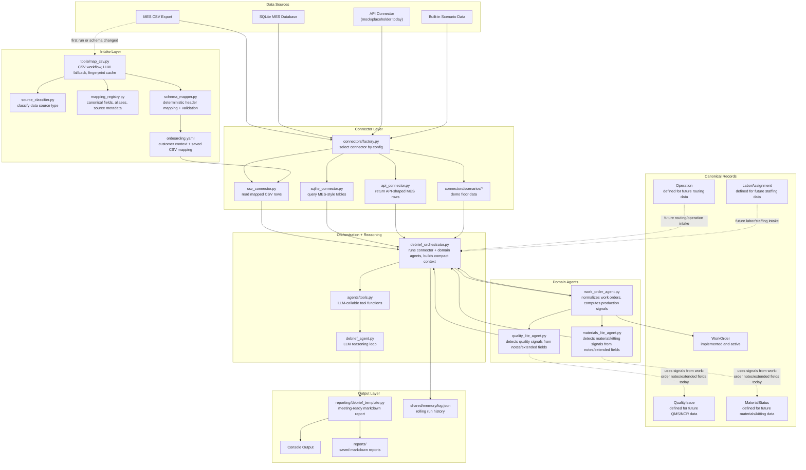

# Corvus Debrief Architecture Flow

This flow shows the current Corvus Debrief architecture after the intake,
canonical record, domain agent, and orchestration layers were added.

## Current Runtime Path

1. `main.py` loads config and onboarding context.
2. `connectors/factory.py` selects the configured data source.
3. CSV sources use `map_csv.py` when no valid mapping exists.
4. `map_csv.py` classifies the source, uses registry aliases, validates required
   fields, and saves mappings to `onboarding.yaml`.
5. The connector returns work-order-shaped records.
6. `DebriefOrchestrator` passes records through the Work Order Agent.
7. The Work Order Agent normalizes records into `WorkOrder` and computes
   deterministic production signals.
8. Quality Lite and Materials Lite agents extract early cross-domain findings
   from notes and extended fields.
9. `agents/tools.py` exposes the orchestrated context to the LLM.
10. `debrief_agent.py` creates the final debrief.
11. `DebriefGenerator` prints and saves the report.
12. Memory stores a compact run history.

## Intentional Boundaries

- Connectors fetch raw data.
- Intake classifies and maps raw source fields.
- Canonical records define stable manufacturing concepts.
- Domain agents produce scoped findings and evidence.
- The orchestrator keeps LLM context compact.
- Reporting turns findings into meeting-ready output.

## Extension Points

The architecture is ready for deeper agents later, but they are not fully
implemented yet:

- Operation/routing intake can feed `Operation`.
- QMS/NCR/inspection intake can feed `QualityIssue`.
- Inventory/kitting intake can feed `MaterialStatus`.
- Labor/shift/certification intake can feed `LaborAssignment`.
- API polling can use the same intake and canonical layers once real partner
  APIs are available.
